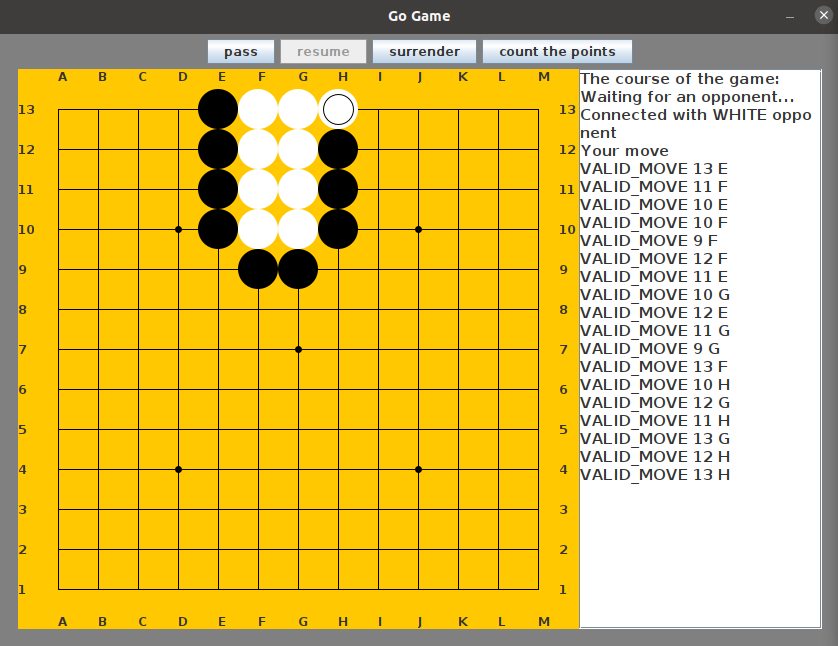

# GoGame

## O projekcie

GoGame to projekt, który implementuje starochińską grę planszową Go. Aplikacja działa w technologii klient-serwer i jest w stanie obsługiwać wiele rozgrywek jednocześnie. Użytkownik ma do wyboru granie z innym graczem lub z botem na jednej z trzech wielkości planszy. Każda rozgrywka jest zapisywana w lokalnej bazie danych, a jej przebieg można później odtworzyć.

## Wygląd

## Wykorzystane narzędzia

* Java
* Swing
* MySQL 8.0.28
* Hibernate 4.1.9

## Autorzy

Jakub Bachanek  
Adam Bednarz ([github link](https://github.com/adbednarz))
